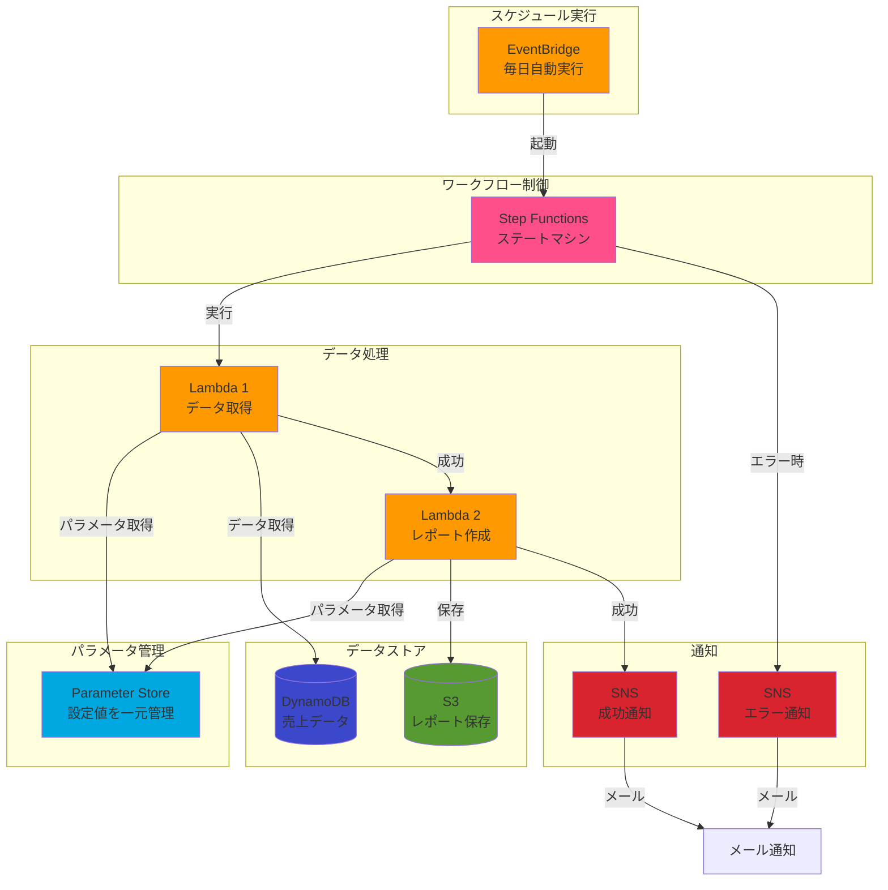
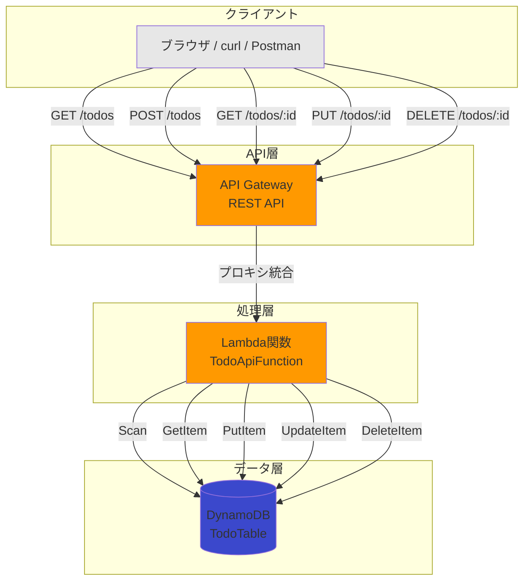

# AWSハンズオンワークショップ - Step Functions実践とサーバーレスAPI構築

所要時間: 約2時間  
前提条件: AWSマネジメントコンソールにログインできること

---

## 本日の目標

- ✅ サーバーレスワークフローを実際に構築する
- ✅ Lambda、Step Functions、EventBridge、SNSを組み合わせる
- ✅ エラーハンドリングとリトライを実装する
- ✅ （時間があれば）REST APIを構築する

---

## ハンズオン1: Step Functions実践ワークフロー構築

### シナリオ

日次データ処理ワークフローを構築します。

実際のシステムを想定した処理を自動化します。

1. DynamoDBから売上データを取得
2. レポートを作成してS3に保存
3. 処理結果をメール通知（S3 URLを含む）
4. エラー時は別の通知を送る

### 全体アーキテクチャ図



IAM権限の流れ：
- Lambda 1: Parameter Store読み取り + DynamoDB読み取り
- Lambda 2: Parameter Store読み取り + S3書き込み
- Step Functions: Lambda呼び出し + SNS発行

---

### ステップ1: DynamoDBテーブルの作成とデータ投入

まずは売上データを格納するDynamoDBテーブルを作成します。

#### 前提

**リージョンの確認**

今回大阪リージョンを使用します。コンソール上のヘッダーが`アジアパシフィック（大阪）`となっていることを確認します。
![image][img-001.png]

**リソース名の命名規則（重要）**

このハンズオンでは、同一AWSアカウント内で複数の参加者が同時に作業します。そのため、すべてのリソース名に識別子を付ける必要があります。

- **基本**: `リソース名-あなたの苗字` の形式で命名
  - 例: `SalesData-jinno`, `TodoAPI-yamada`
  
- **苗字が被る場合**: フルネームまたは任意の識別子を使用
  - 例: `SalesData-jinno-yudai`, `SalesData-jinno2`, `SalesData-jinnoy`
  - 重要: 一度決めた識別子は、すべてのリソースで統一して使用してください
  
- **識別子の例**:
  - フルネーム: `tanaka-taro`
  - イニシャル: `tanaka-t`
  - 番号付き: `tanaka1`, `tanaka2`
  - ニックネーム: `tanaka-tk`

この命名規則により、リソースの所有者が明確になり、クリーンアップ時にも自分のリソースを簡単に識別できます。

#### 1-1. DynamoDBコンソールを開く

1. AWSマネジメントコンソールにログイン
2. 検索バーで「DynamoDB」と入力して選択
	![image][img-002.png]

#### 1-2. テーブルを作成

1. 左メニューから「テーブル」を選択
2. 「テーブルの作成」ボタンをクリック
	![image][img-003.png]
3. 以下のように設定：
   - テーブル名: `SalesData-あなたの名前`
     - 例: `SalesData-jinno`
     - 重要: 同一アカウントで複数の参加者が作業するため、名前を含めてください
   - パーティションキー: `date` (文字列)
   	![image][img-004.png]
4. その他はデフォルトのまま
5. 「テーブルの作成」をクリック
6. テーブルのステータスが「アクティブ」になるまで待つ（約1分）
	![image][img-005.png]

#### 1-3. サンプルデータを投入

1. 作成した `SalesData` テーブルを選択
2. 「アクション」ボタンをクリック
3. 「項目を作成」ボタンをクリック
	![image][img-006.png]
4. 以下のデータを入力（JSON形式で入力する場合は右上の「JSON」ビューに切り替え）

1件目
![image][img-007.png]

```json
{
  "date": {
    "S": "2025-10-27"
  },
  "total_sales": {
    "N": "450000"
  },
  "total_orders": {
    "N": "150"
  },
  "top_product": {
    "S": "商品A"
  }
}
```

5. 「テーブルの詳細を表示」ボタンで元の画面に戻り、再度「項目を作成」をクリック
6. 同様にもう1件追加（異なる日付で）

2件目

```json
{
  "date": {
    "S": "2025-10-26"
  },
  "total_sales": {
    "N": "320000"
  },
  "total_orders": {
    "N": "98"
  },
  "top_product": {
    "S": "商品B"
  }
}
```

✅ 確認ポイント: `SalesData-あなたの名前` テーブルが作成され、2件のデータが登録されていること（テーブル名をメモしておく）

---

### ステップ2: S3バケットの作成

レポートを保存するS3バケットを作成します。

#### 2-1. S3コンソールを開く

1. 検索バーで「S3」と入力
	![image][img-008.png]
2. 「バケットを作成」ボタンをクリック
	![image][img-009.png]

#### 2-2. バケットを作成

1. 以下のように設定：
   - バケット名: `daily-report-YYYYMMDD-あなたの名前` 
     - 例: `daily-report-20251027-jinno`
     - 重要: S3バケット名は全世界で一意である必要があります
     	![image][img-010.png]
2. その他はデフォルトのまま
3. 「バケットを作成」をクリック

✅ 確認ポイント: S3バケットが作成されていること（バケット名をメモしておく）

---

### ステップ3: Parameter Storeでパラメータを管理

Lambda関数で使用するパラメータをAWS Systems Manager Parameter Storeに登録します。

#### 3-1. Systems Managerコンソールを開く

1. 検索バーで「Systems Manager」と入力
	![image][img-011.png]
2. 左メニューから「パラメータストア」を選択
	![image][img-012.png]

#### 3-2. テーブル名のパラメータを作成

1. 「パラメータの作成」ボタンをクリック
	![image][img-013.png]
2. 以下のように設定：
   - 名前: `/workshop/あなたの名前/table-name`
     - 例: `/workshop/jinno/table-name`
   - 説明: DynamoDBテーブル名
   - タイプ: 文字列
   - データ型：text
   - 値: `SalesData-あなたの名前`
     - 例: `SalesData-jinno`（ステップ1で作成したテーブル名）
   
   ![image][img-014.png]
3. 「パラメータの作成」をクリック

#### 3-3. バケット名のパラメータを作成

1. もう一度「パラメータの作成」ボタンをクリック

2. 以下のように設定
   - 名前: `/workshop/あなたの名前/bucket-name`
     - 例: `/workshop/jinno/bucket-name`
   - 説明: S3バケット名
   - タイプ: 文字列
   - データ型：text
   - 値: `daily-report-20251027-あなたの名前`
     - 例: `daily-report-20251027-jinno`（ステップ2で作成したバケット名）
   
   
   
3. 「パラメータの作成」をクリック

> Parameter Storeとは。
> - AWSの設定値や秘密情報を安全に保存・管理するサービス
> - Lambda関数などから動的に値を取得可能
> - 値を変更してもコードの修正が不要
> - 本番環境でも広く使用されているベストプラクティス

✅ 確認ポイント: 2つのパラメータが作成されていること

---

### ステップ4: SNSトピックの作成

まずは通知先のSNSトピックを作成します。

#### 1-1. SNSコンソールを開く

1. AWSマネジメントコンソールにログイン
2. 検索バーで「SNS」と入力し、Amazon Simple Notification Service を選択
	![image][img-015.png]

#### 1-2. トピックを作成

1. 左メニューから「トピック」を選択

2. 「トピックの作成」ボタンをクリック
	![image][img-016.png]

3. 以下のように設定：
   - タイプ: スタンダード
   
   - 名前: `daily-report-topic-あなたの名前`
     - 例: `daily-report-topic-jinno`
     
     ![image][img-017.png]
   
4. その他はデフォルトのまま

5. 「トピックの作成」ボタンをクリック

#### 1-3. サブスクリプションを作成（メール通知設定）

1. 作成したトピックの詳細画面で「サブスクリプションの作成」をクリック
	![image][img-018.png]
2. 以下のように設定：
   - プロトコル: Email
   - エンドポイント: あなたのメールアドレスを入力
   
   ![image][img-019.png]
3. 「サブスクリプションの作成」をクリック
4. 重要: 登録したメールアドレスに確認メールが届くので、メール内のリンクをクリックして承認してください
	![image][img-020.png]
	![image][img-021.png]

#### 1-4. エラー通知用トピックも作成

同じ手順で、エラー通知用のトピックも作成します。
- 名前: `daily-report-error-topic-あなたの名前`
  - 例: `daily-report-error-topic-jinno`
- サブスクリプションも同じメールアドレスで設定

✅ 確認ポイント: 2つのトピックが作成され、メール承認が完了していること

---

### ステップ5: Lambda関数の作成（DynamoDBからデータ取得）

#### 5-1. Lambdaコンソールを開く

1. 検索バーで「Lambda」と入力し、AWS Lambda を選択
	![image][img-022.png]

#### 5-2. 1つ目のLambda関数を作成

1. 左メニュー「関数」を選択し、「関数の作成」ボタンをクリック
	![image][img-023.png]
2. 「一から作成」を選択
3. 以下のように設定：
   - 関数名: `FetchDataFunction-あなたの名前`
     - 例: `FetchDataFunction-jinno`
   - ランタイム: Python 3.13
   - アーキテクチャ: x86_64
   - 実行ロール: 「基本的な Lambda アクセス権限で新しいロールを作成」を選択
   	![image][img-024.png]
4. 「関数の作成」をクリック

#### 5-3. IAMロールに必要な権限を追加

Lambda関数がDynamoDBとParameter Storeにアクセスできるように、IAM権限を追加します。

1. 作成した関数の「設定」タブをクリック
2. 左メニューから「アクセス権限」を選択
3. 実行ロールのリンク（例: `FetchDataFunction-jinno-role-xxx`）をクリック
	![image][img-025.png]
4. IAMコンソールが開くので、「許可を追加」→「ポリシーをアタッチ」をクリック
	![image][img-026.png]
5. 以下の2つのポリシーを検索して追加
   - `AmazonDynamoDBReadOnlyAccess`（DynamoDB読み取り権限）
   - `AmazonSSMReadOnlyAccess`（Parameter Store読み取り権限）
6. それぞれチェックボックスを選択し、「ポリシーのアタッチ」をクリック

> IAMポリシーの解説。
> - `AmazonDynamoDBReadOnlyAccess`: DynamoDBのテーブルからデータを読み取る権限
> - `AmazonSSMReadOnlyAccess`: Parameter Storeからパラメータを読み取る権限
> - これらをLambdaの実行ロールにアタッチすることで、Lambda関数が必要なリソースにアクセス可能になります

最終的に以下のように追加されていればOKです。
![image][img-027.png]

#### 5-4. 環境変数を設定

Parameter Storeのパラメータ名を環境変数として設定します。

1. Lambda関数の「設定」タブ

2. 左メニューから「環境変数」を選択

3. 「編集」ボタンをクリック
	![image][img-028.png]

4. 「環境変数を追加」をクリック
	![image][img-029.png]

5. 以下のように設定：
   - キー: `PARAM_TABLE_NAME`
   
   - 値: `/workshop/あなたの名前/table-name`
     - 例: `/workshop/jinno/table-name`
     
     ![image][img-030.png]
   
6. 「保存」をクリック

#### 5-5. 関数コードを記述

Lambda関数の「コード」タブに戻り、以下のコードを `lambda_function.py` に貼り付けます：

```python
import json
import boto3
import os
from datetime import datetime
import random

# AWSクライアントを初期化
ssm_client = boto3.client('ssm')
dynamodb = boto3.resource('dynamodb')

def lambda_handler(event, context):
    """
    DynamoDBから売上データを取得する関数
    Parameter Storeからテーブル名を取得し、パーティションキーで効率的にデータ取得
    """
    print("データ取得を開始します...")
    
    # ランダムにエラーをシミュレート（10%の確率）
    if random.random() < 0.1:
        print("データ取得に失敗しました")
        raise Exception("DynamoDBへの接続に失敗しました")
    
    try:
        # Parameter Storeからテーブル名を取得
        param_name = os.environ['PARAM_TABLE_NAME']
        print(f"Parameter Store取得: {param_name}")
        
        response = ssm_client.get_parameter(Name=param_name)
        table_name = response['Parameter']['Value']
        print(f"DynamoDBテーブル名: {table_name}")
        
        # DynamoDBテーブルを取得
        table = dynamodb.Table(table_name)
        
        # 今日の日付でデータを取得
        today = datetime.now().strftime("%Y-%m-%d")
        print(f"検索日付: {today}")
        
        db_response = table.get_item(Key={'date': today})
        
        # データが見つからない場合は、サンプルデータの日付を使用
        if 'Item' not in db_response:
            print(f"{today}のデータが見つかりません。サンプルデータ（2025-10-27）を取得します...")
            # サンプルデータの日付で再取得（Scanは使わない！）
            db_response = table.get_item(Key={'date': '2025-10-27'})
            
            if 'Item' not in db_response:
                raise Exception("サンプルデータが見つかりません。DynamoDBにデータを登録してください。")
        
        sales_data = db_response['Item']
        print(f"データ取得完了: {sales_data}")
        
        return {
            "statusCode": 200,
            "body": {
                "date": str(sales_data['date']),
                "total_sales": int(sales_data['total_sales']),
                "total_orders": int(sales_data['total_orders']),
                "top_product": str(sales_data['top_product'])
            }
        }
    
    except Exception as e:
        print(f"エラー発生: {str(e)}")
        raise

```

#### 5-6. デプロイとテスト

1. 「Deploy」ボタンをクリック
2. 「Test」タブに移動
3. 「新しいイベントを作成」を選択
   - イベント名: `test-event`
   - イベントJSON: デフォルトのまま（空のJSONでOK）
4. 「保存」してから「テスト」ボタンをクリック
	![image][img-031.png]
5. 実行結果を確認（DynamoDBから取得した売上データが返ってくる）

> **注意: テスト実行時にエラーが出る場合があります！**
> - この関数には、Step Functionsのエラーハンドリングとリトライ機能を体験するため、**意図的に10%の確率でエラーが発生する**コードが含まれています
> - テスト実行時にエラーが出ても、それは正常な動作です
> - 何度かテストを実行すると、成功することもあればエラーになることもあります
> - これにより、後のステップでStep Functionsが自動的にリトライする様子を確認できます

✅ 確認ポイント: 
- 関数が正常に実行される（エラーが出た場合は再度テストしてみてください）
- Parameter Storeからテーブル名が取得できている
- DynamoDBから実際のデータが取得できている
- IAM権限が正しく設定されている

---

### ステップ6: Lambda関数の作成（レポート作成してS3に保存）

#### 6-1. 2つ目のLambda関数を作成

1. Lambda コンソールで「関数の作成」をクリック
2. 以下のように設定：
   - 関数名: `CreateReportFunction-あなたの名前`
     - 例: `CreateReportFunction-jinno`
   - ランタイム: Python 3.13
   - 実行ロール: 「基本的な Lambda アクセス権限で新しいロールを作成」
3. 「関数の作成」をクリック

#### 6-2. IAMロールに必要な権限を追加

Lambda関数がS3とParameter Storeにアクセスできるように、IAM権限を追加します。

1. 作成した関数の「設定」タブをクリック
2. 左メニューから「アクセス権限」を選択
3. 実行ロールのリンク（例: `CreateReportFunction-jinno-role-xxx`）をクリック
4. IAMコンソールが開くので、「許可を追加」→「ポリシーをアタッチ」をクリック
5. 以下の2つのポリシーを検索して追加：
   - `AmazonS3FullAccess`（S3書き込み権限）
   - `AmazonSSMReadOnlyAccess`（Parameter Store読み取り権限）
6. それぞれチェックボックスを選択し、「ポリシーのアタッチ」をクリック

> IAMポリシーの解説。
> - `AmazonS3FullAccess`: S3バケットへの読み書き権限
> - `AmazonSSMReadOnlyAccess`: Parameter Storeからパラメータを読み取る権限
> - これらをLambdaの実行ロールにアタッチすることで、Lambda関数が必要なリソースにアクセス可能になります
> - 本番環境では: 特定のバケットのみアクセスできるよう、より限定的な権限を設定することを推奨

#### 6-3. 環境変数を設定

Parameter Storeのパラメータ名を環境変数として設定します。

1. Lambda関数の「設定」タブ
2. 左メニューから「環境変数」を選択
3. 「編集」ボタンをクリック
4. 「環境変数を追加」をクリック
5. 以下のように設定：
   - キー: `PARAM_BUCKET_NAME`
   - 値: `/workshop/あなたの名前/bucket-name`
     - 例: `/workshop/jinno/bucket-name`
6. 「保存」をクリック

#### 6-4. 関数コードを記述

Lambda関数の「コード」タブに戻り、以下のコードを記述：

```python
import json
import boto3
import os
from datetime import datetime

# AWSクライアントを初期化
ssm_client = boto3.client('ssm')
s3_client = boto3.client('s3')

def lambda_handler(event, context):
    """
    受け取ったデータからレポートを作成してS3に保存する関数
    Parameter Storeからバケット名を取得
    """
    print("レポート作成を開始します...")
    print(f"受信データ: {event}")
    
    try:
        # Parameter StoreからS3バケット名を取得
        param_name = os.environ['PARAM_BUCKET_NAME']
        print(f"Parameter Store取得: {param_name}")
        
        response = ssm_client.get_parameter(Name=param_name)
        bucket_name = response['Parameter']['Value']
        print(f"S3バケット名: {bucket_name}")
        
        # 前のLambdaからのデータを取得
        # Step Functionsから渡されるデータ構造を考慮
        if 'body' in event:
            sales_data = event['body']
        else:
            sales_data = event
        
        # レポートを作成
        report = {
            "report_date": datetime.now().strftime("%Y-%m-%d %H:%M:%S"),
            "summary": {
                "date": sales_data.get("date", "N/A"),
                "total_sales": f"¥{sales_data.get('total_sales', 0):,}",
                "total_orders": sales_data.get("total_orders", 0),
                "top_product": sales_data.get("top_product", "N/A"),
                "average_order_value": f"¥{sales_data.get('total_sales', 0) // max(sales_data.get('total_orders', 1), 1):,}"
            },
            "status": "success"
        }
        
        print(f"レポート作成完了: {report}")
        
        # S3にレポートを保存
        timestamp = datetime.now().strftime("%Y%m%d_%H%M%S")
        file_name = f"reports/daily_report_{timestamp}.json"
        
        # JSON形式でS3にアップロード
        s3_client.put_object(
            Bucket=bucket_name,
            Key=file_name,
            Body=json.dumps(report, ensure_ascii=False, indent=2),
            ContentType='application/json'
        )
        
        # S3のURLを生成
        s3_url = f"https://{bucket_name}.s3.ap-northeast-3.amazonaws.com/{file_name}"
        
        print(f"S3にレポートを保存しました: {s3_url}")
        
        return {
            "statusCode": 200,
            "report": report,
            "s3_url": s3_url,
            "bucket": bucket_name,
            "key": file_name
        }
    
    except Exception as e:
        print(f"エラー発生: {str(e)}")
        raise
```

#### 6-5. デプロイとテスト

1. 「Deploy」ボタンをクリック
2. 「Test」タブで新しいテストイベントを作成します。下記JSONを入力して、任意の名前をつけて「保存」して、「テスト」を実行します。

```json
{
  "body": {
    "date": "2025-10-27",
    "total_sales": 350000,
    "total_orders": 120,
    "top_product": "商品A"
  }
}
```

3. テストを実行して、レポートが作成されることを確認
4. S3コンソールで確認: バケット内に `reports/` フォルダが作成され、レポートファイルがアップロードされていることを確認
	![image][img-032.png]

✅ 確認ポイント: 
- レポートが正常に作成される
- Parameter Storeからバケット名が取得できている
- S3にファイルがアップロードされている
- S3 URLが返される
- IAM権限が正しく設定されている

---

### ステップ7: Step Functionsステートマシンの作成

いよいよワークフローを組み立てます！

#### 7-1. Step Functionsコンソールを開く

1. 検索バーで「Step Functions」と入力
2. 「ステートマシン」メニューを選択
	![image][img-033.png]
3. 「ステートマシンの作成」ボタンをクリック
	![image][img-034.png]

#### 7-2. ステートマシンの設定

1. 「空白から作成」を選択
2. タイプ: 標準
3. 名前: `DailyReportStateMachine-あなたの名前`
   - 例: `DailyReportStateMachine-jinno`
   	![image][img-035.png]
4. 左側の定義エディタに以下のコードを貼り付け：

> 重要: 以下のJSON内の `FetchDataFunction`, `CreateReportFunction`, SNSトピックのARNを、あなたが作成したリソース名に置き換えてください。

```json
{
  "Comment": "日次レポート作成ワークフロー - DynamoDBからデータ取得してS3に保存",
  "StartAt": "FetchDataFromDynamoDB",
  "States": {
    "FetchDataFromDynamoDB": {
      "Type": "Task",
      "Resource": "arn:aws:states:::lambda:invoke",
      "Parameters": {
        "FunctionName": "FetchDataFunction-あなたの名前",
        "Payload": {
          "input.$": "$"
        }
      },
      "ResultPath": "$.fetchResult",
      "Next": "CreateReportAndSaveToS3",
      "Retry": [
        {
          "ErrorEquals": ["States.ALL"],
          "IntervalSeconds": 2,
          "MaxAttempts": 2,
          "BackoffRate": 2
        }
      ],
      "Catch": [
        {
          "ErrorEquals": ["States.ALL"],
          "Next": "NotifyError",
          "ResultPath": "$.error"
        }
      ]
    },
    "CreateReportAndSaveToS3": {
      "Type": "Task",
      "Resource": "arn:aws:states:::lambda:invoke",
      "Parameters": {
        "FunctionName": "CreateReportFunction-あなたの名前",
        "Payload": {
          "body.$": "$.fetchResult.Payload.body"
        }
      },
      "ResultPath": "$.reportResult",
      "Next": "NotifySuccess",
      "Catch": [
        {
          "ErrorEquals": ["States.ALL"],
          "Next": "NotifyError",
          "ResultPath": "$.error"
        }
      ]
    },
    "NotifySuccess": {
      "Type": "Task",
      "Resource": "arn:aws:states:::sns:publish",
      "Parameters": {
        "TopicArn": "arn:aws:sns:ap-northeast-3:YOUR_ACCOUNT_ID:daily-report-topic-あなたの名前",
        "Subject": "日次レポート作成完了",
        "Message.$": "States.Format('日次レポートが正常に作成されました。\n\n--- レポート概要 ---\n日付: {}\n総売上: {}\n注文数: {}\nトップ商品: {}\n平均注文額: {}\n\n--- S3保存情報 ---\nレポートURL: {}\nバケット: {}\n\n処理時刻: {}', $.reportResult.Payload.report.summary.date, $.reportResult.Payload.report.summary.total_sales, $.reportResult.Payload.report.summary.total_orders, $.reportResult.Payload.report.summary.top_product, $.reportResult.Payload.report.summary.average_order_value, $.reportResult.Payload.s3_url, $.reportResult.Payload.bucket, $.reportResult.Payload.report.report_date)"
      },
      "End": true
    },
    "NotifyError": {
      "Type": "Task",
      "Resource": "arn:aws:states:::sns:publish",
      "Parameters": {
        "TopicArn": "arn:aws:sns:ap-northeast-3:YOUR_ACCOUNT_ID:daily-report-error-topic-あなたの名前",
        "Subject": "日次レポート作成エラー",
        "Message.$": "States.Format('日次レポートの作成中にエラーが発生しました。\n\nエラー内容:\n{}', $.error.Cause)"
      },
      "End": true
    }
  }
}
```


#### 7-3. SNS ARNの置き換え

重要: 上記のJSONで `YOUR_ACCOUNT_ID` と `あなたの名前` を実際の値に置き換える必要があります。

**成功通知用のARN設定**

1. SNSコンソールを別タブで開く
2. `daily-report-topic-あなたの名前` の詳細を開く
3. ARN をコピー（例: `arn:aws:sns:ap-northeast-3:123456789012:daily-report-topic-jinno`）
	![image][img-036.png]
4. Step FunctionsのJSON定義内の `NotifySuccess` ステートの `TopicArn` に貼り付け

```json
"NotifySuccess": {
  "Type": "Task",
  "Resource": "arn:aws:states:::sns:publish",
  "Parameters": {
    "TopicArn": "arn:aws:sns:ap-northeast-3:123456789012:daily-report-topic-jinno",  ← ここにコピーしたARNを貼り付け
    "Subject": "日次レポート作成完了",
    "Message.$": "..."
  },
  "End": true
}
```

**エラー通知用のARN設定**

5. 同様に `daily-report-error-topic-あなたの名前` のARNをコピー
6. `NotifyError` ステートの `TopicArn` に貼り付け

```json
"NotifyError": {
  "Type": "Task",
  "Resource": "arn:aws:states:::sns:publish",
  "Parameters": {
    "TopicArn": "arn:aws:sns:ap-northeast-3:123456789012:daily-report-error-topic-jinno",  ← ここにコピーしたARNを貼り付け
    "Subject": "日次レポート作成エラー",
    "Message.$": "..."
  },
  "End": true
}
```

1. ロールの作成を確認で権限を追加します。
	![image][img-037.png]
2. ステートマシンは正常に作成されましたと表示されていれば、完了です！
	![image][img-038.png]

✅ 確認ポイント: ステートマシンが作成され、グラフビューでワークフローが表示されること

---

### ステップ8: ワークフローのテスト実行

#### 8-1. 実行してみる

1. ステートマシンの詳細画面で「実行を開始」ボタンをクリック
	![image][img-039.png]
2. 実行名はデフォルトのまま（自動生成）
3. 入力は空のJSON `{}` のままでOK
4. 「実行の開始」をクリック
	![image][img-040.png]

#### 8-2. 実行状況を確認

1. グラフビューで各ステップの実行状況を確認
2. 各ステップをクリックすると、入力・出力データが確認できます
3. 緑色になれば成功！
	![image][img-041.png]

#### 8-3. メール通知とS3を確認

1. メール通知: 登録したメールアドレスに、レポート完成の通知が届いているはずです
   - メール本文にS3のURLが含まれています
   	![image][img-042.png]
2. S3確認: S3コンソールで、バケット内に `reports/` フォルダとレポートファイルが作成されていることを確認
3. レポート確認: S3のファイルをダウンロードして、JSON形式のレポートを確認
	![image][img-043.png]

#### 8-4. エラーパターンもテストしてみる

何度か実行すると、ランダムでエラーが発生します（10%の確率）。
エラー時は自動的に：
1. 2回リトライされる（Step Functionsのグラフビューで確認可能）
2. それでも失敗したらエラー通知が送られる

という動きを確認できます。

✅ 確認ポイント: 
- 成功時に成功通知メールが届く（S3 URLが含まれる）
- S3にレポートファイルが保存されている
- エラー時にエラー通知メールが届く
- リトライが動作している
- DynamoDBからデータが取得されている
- Parameter Storeから設定値が正しく取得されている

---

### ステップ9: EventBridgeでスケジュール実行

最後に、このワークフローを毎日自動実行するように設定します。

#### 9-1. EventBridgeコンソールを開く

1. 検索バーで「EventBridge」と入力
	![image][img-044.png]
2. 左メニューから「スケジュール」を選択
3. 「スケジュールを作成」ボタンをクリック
	![image][img-045.png]

#### 9-2. スケジュールの設定

**スケジュールの詳細**
1. スケジュール名: `daily-report-schedule-あなたの名前`
   - 例: `daily-report-schedule-jinno`
2. スケジュールグループ: default

**スケジュールパターン**
1. 頻度: 定期的なスケジュールを選択
2. タイムゾーン: `(UTC+09:00) Asia/Tokyo` を検索して選択
3. スケジュールの種類: rate ベースのスケジュールを選択
4. rate 式を設定：
   - 値: `10`
   - 単位: `minutes`（分）
   - これで「10分ごと」にワークフローが実行されます
5. フレックスタイムウィンドウ: オフ（デフォルト）
6. 「次へ」をクリック

![image][img-046.png]

**ステップ2: ターゲットの選択**

1. ターゲット API: 「テンプレート化されたターゲット」から以下を選択
   - `AWS Step Functions StartExecution` を選択
2. ステートマシン: `DailyReportStateMachine-あなたの名前` を選択
   - 例: `DailyReportStateMachine-jinno`
3. 入力: デフォルトのまま（`{}` が入力されていることを確認）
4. 「次へ」をクリック

![image][img-047.png]

**ステップ3: 設定（オプション）**

1. 実行ロール: 「このスケジュールのための新しいロールを作成」を選択
2. その他の設定はデフォルトのまま
3. 「次へ」をクリック

#### ](./assets/img-048.png)

**ステップ4: スケジュールの確認と作成**

1. 設定内容を確認
2. 「スケジュールを作成」をクリック

](./assets/img-049.png)

#### 9-3. 動作確認

10分待ってStep Functionsコンソールで実行履歴を確認してみましょう。
自動的に実行が開始されているはずです！

✅ 確認ポイント: スケジュールに従って自動実行される

![image][img-050.png]

---

### ハンズオン1完了！

お疲れさまでした！以下のことができるようになりました。

- ✅ Parameter Storeでパラメータを一元管理（ベストプラクティス）
- ✅ DynamoDBテーブルの作成とデータ投入（識別子付き命名）
- ✅ S3バケットの作成
- ✅ Lambda関数でParameter StoreとDynamoDBを使用（IAM: SSM + DynamoDB権限）
- ✅ Lambda関数でParameter StoreとS3を使用（IAM: SSM + S3権限）
- ✅ 複数のLambda関数を組み合わせる
- ✅ Step Functionsでワークフローを制御
- ✅ エラーハンドリングとリトライ
- ✅ SNS通知の設定（S3 URLを含む）
- ✅ EventBridgeでスケジュール実行
- ✅ IAM権限の理解と実践（デフォルトロールへのポリシーアタッチ）
- ✅ 同一アカウントでのリソース名重複回避（識別子の追加）

---

## ハンズオン2: サーバーレスREST API構築（+ α）

REST APIの構築も体験しましょう！

### シナリオ

「シンプルなTODO管理API」を構築します。

実装するAPI:
- `POST /todos` - TODOを作成
- `GET /todos` - TODO一覧を取得
- `GET /todos/{id}` - 特定のTODOを取得
- `PUT /todos/{id}` - TODOを更新
- `DELETE /todos/{id}` - TODOを削除

### 全体アーキテクチャ図



IAM権限の流れ：
- Lambda関数: DynamoDB Full Access（読み取り + 書き込み）
- API Gateway: Lambda呼び出し権限（自動設定）

---

### ステップ1: DynamoDBテーブルの作成

#### 1-1. DynamoDBコンソールを開く

1. 検索バーで「DynamoDB」と入力
2. 左メニューから「テーブル」を選択
3. 「テーブルの作成」ボタンをクリック

#### 1-2. テーブルを作成

1. 以下のように設定：
   - テーブル名: `TodoTable-あなたの名前`
     - 例: `TodoTable-jinno`
     - 重要: 同一アカウントで複数の参加者が作業するため、名前を含めてください
   - パーティションキー: `id` (文字列)
2. その他はデフォルトのまま
3. 「テーブルの作成」をクリック

![image][img-051.png]

✅ 確認ポイント: テーブルが作成され、ステータスが「アクティブ」になること

![image][img-052.png]

---

### ステップ2: Lambda関数の作成（CRUD API）

#### 2-1. Lambda関数を作成

1. Lambdaコンソールで「関数の作成」
2. 以下のように設定：
   - 関数名: `TodoApiFunction-あなたの名前`
     - 例: `TodoApiFunction-jinno`
   - ランタイム: Python 3.13
   - 実行ロール: 「基本的な Lambda アクセス権限で新しいロールを作成」

![image][img-053.png]

#### 2-2. 関数コードを記述

下記コードを実行して「Deploy」ボタンを選択します。

```python
import json
import boto3
import uuid
import os
from datetime import datetime

dynamodb = boto3.resource('dynamodb')
# 環境変数からテーブル名を取得
table_name = os.environ.get('TABLE_NAME', 'TodoTable-jinno')
table = dynamodb.Table(table_name)

def lambda_handler(event, context):
    """
    API Gateway からのリクエストを処理する
    """
    print(f"Event: {json.dumps(event)}")
    
    http_method = event['httpMethod']
    path = event['path']
    
    try:
        if http_method == 'GET' and path == '/todos':
            # TODO一覧取得
            response = table.scan()
            return create_response(200, response['Items'])
            
        elif http_method == 'GET' and '/todos/' in path:
            # 特定のTODO取得
            todo_id = path.split('/')[-1]
            response = table.get_item(Key={'id': todo_id})
            if 'Item' in response:
                return create_response(200, response['Item'])
            else:
                return create_response(404, {'message': 'TODO not found'})
                
        elif http_method == 'POST' and path == '/todos':
            # TODO作成
            body = json.loads(event['body'])
            todo_id = str(uuid.uuid4())
            item = {
                'id': todo_id,
                'title': body.get('title'),
                'completed': body.get('completed', False),
                'createdAt': datetime.now().isoformat()
            }
            table.put_item(Item=item)
            return create_response(201, item)
            
        elif http_method == 'PUT' and '/todos/' in path:
            # TODO更新
            todo_id = path.split('/')[-1]
            body = json.loads(event['body'])
            
            response = table.update_item(
                Key={'id': todo_id},
                UpdateExpression='SET title = :title, completed = :completed',
                ExpressionAttributeValues={
                    ':title': body.get('title'),
                    ':completed': body.get('completed', False)
                },
                ReturnValues='ALL_NEW'
            )
            return create_response(200, response['Attributes'])
            
        elif http_method == 'DELETE' and '/todos/' in path:
            # TODO削除
            todo_id = path.split('/')[-1]
            table.delete_item(Key={'id': todo_id})
            return create_response(200, {'message': 'TODO deleted'})
            
        else:
            return create_response(400, {'message': 'Unsupported route'})
            
    except Exception as e:
        print(f"Error: {str(e)}")
        return create_response(500, {'message': str(e)})

def create_response(status_code, body):
    """
    API Gatewayに返すレスポンスを生成
    """
    return {
        'statusCode': status_code,
        'headers': {
            'Content-Type': 'application/json',
            'Access-Control-Allow-Origin': '*'  # CORS対応
        },
        'body': json.dumps(body, ensure_ascii=False)
    }
```

#### 2-3. 環境変数を設定

Lambda関数にテーブル名を環境変数として設定します。

1. Lambda関数の「設定」タブをクリック
2. 左メニューから「環境変数」を選択
3. 「編集」ボタンをクリック
4. 「環境変数を追加」をクリック
5. 以下のように設定：
   - キー: `TABLE_NAME`
   - 値: `TodoTable-あなたの名前`
     - 例: `TodoTable-jinno`
6. 「保存」をクリック

![image][img-054.png]

#### 2-4. IAMロールにDynamoDB権限を追加

1. Lambda関数の「設定」タブ → 「アクセス権限」
2. 実行ロール名のリンクをクリック（IAMコンソールが開く）
3. 「許可を追加」→「ポリシーをアタッチ」
4. `AmazonDynamoDBFullAccess` を検索して追加
	![image][img-055.png]

✅ 確認ポイント: Lambda関数がデプロイされ、DynamoDB権限が追加されていること

![image][img-056.png]

---

### ステップ3: API Gatewayの作成

#### 3-1. API Gatewayコンソールを開く

1. 検索バーで「API Gateway」と入力
	![image][img-057.png]
2. 「APIを作成」ボタンをクリック
	![image][img-058.png]
3. REST API（プライベートではない方）の「構築」をクリック
	![image][img-059.png]

#### 3-2. APIを作成

1. 以下のように設定：
   - プロトコルを選択: REST
   - 新しいAPIの作成: 新しいAPI
   - API名: `TodoAPI-あなたの名前`
     - 例: `TodoAPI-jinno`
   - エンドポイントタイプ: リージョン
2. 「APIを作成」をクリック

![image][img-060.png]

#### 3-3. リソースとメソッドの作成

1. 「リソースを作成」を選択
	![image][img-061.png]

2. リソースパス: `todos`に入力

3. 「リソースの作成」をクリック
	![image][img-062.png]

4. `/todos` を選択した状態で、「メソッドの作成」
	![image][img-063.png]

5. メソッドタイプ: GET を選択

6. 以下のように設定：
   - 統合タイプ: Lambda関数
   - Lambdaプロキシ統合: オン（チェックを入れる）← 重要！
   - Lambda関数: `TodoApiFunction-あなたの名前`
     - 例: `TodoApiFunction-jinno`
   - Lambda関数のリージョン: ap-northeast-3

   ![image][img-064.png]

> **Lambdaプロキシ統合とは。**
> - API GatewayがHTTPリクエストの情報（httpMethod、path、headersなど）をそのままLambdaに渡す設定
> - これを有効にしないと、Lambda関数がリクエスト情報にアクセスできずエラーになります

7. 「メソッドを作成」をクリック

8. POST メソッドを追加

同様の手順で、`/todos` に POST メソッドも追加します。
- メソッドタイプ: POST
- 統合タイプ: Lambda関数
- **Lambdaプロキシ統合: オン**（必ずチェック）
- Lambda関数: `TodoApiFunction-あなたの名前`

9. `{id}`リソースを追加

`/todos` を選択した状態で、「リソースを作成」ボタンを選択
	![image][img-065.png]

10. リソースパス: `{id}` （波括弧を含める）
	![image][img-066.png]

11. 「リソースの作成」をクリック

12. GET, PUT, DELETE メソッドを追加

`/todos/{id}` リソースを選択した状態で、以下の3つのメソッドを追加します。
**重要**: それぞれのメソッドで必ず「Lambdaプロキシ統合: オン」にチェックを入れてください。

- **GETメソッド**:
  - メソッドタイプ: GET
  - 統合タイプ: Lambda関数
  - Lambdaプロキシ統合: オン
  - Lambda関数: `TodoApiFunction-あなたの名前`

- **PUTメソッド**:
  - メソッドタイプ: PUT
  - 統合タイプ: Lambda関数
  - Lambdaプロキシ統合: オン
  - Lambda関数: `TodoApiFunction-あなたの名前`

- **DELETEメソッド**:
  - メソッドタイプ: DELETE
  - 統合タイプ: Lambda関数
  - Lambdaプロキシ統合: オン
  - Lambda関数: `TodoApiFunction-あなたの名前`

#### 3-5. APIをデプロイ

**重要**: メソッドを作成しただけでは反映されません。必ずデプロイが必要です！

1. 「APIをデプロイ」
	![image][img-067.png]
2. 以下のように設定：
   - デプロイされるステージ: [新しいステージ]
   - ステージ名: `prod`
3. 「デプロイ」をクリック
	![image][img-068.png]
4. URLを呼び出し欄に表示されるURLをメモ
   - 例: `https://xxxxxxxxxx.execute-api.ap-northeast-3.amazonaws.com/prod`

✅ 確認ポイント: API URLが発行されること
![image][img-069.png]

---

### ステップ4: APIをテストする

APIが完成しました！実際に動かしてみましょう。

#### 4-1. ブラウザでテスト（GET）

ブラウザで以下のURLを開く：
```
https://あなたのAPI-ID.execute-api.ap-northeast-3.amazonaws.com/prod/todos
```

空の配列 `[]` が返ってくればOK！

#### 4-2. コマンドラインでテスト（CRUD操作）

**環境による違いについて**

curlコマンドの利用可否：
- ✅ **Windows 10/11**: curlコマンドが標準で利用可能（Windows 10バージョン1803以降）
- ✅ **macOS**: curlコマンドがプリインストール済み
- ✅ **Linux**: curlコマンドがプリインストール済み

curlが使えるか確認する方法：
```bash
# Windows PowerShell / Mac / Linux
curl --version
```

バージョン情報が表示されればcurlが利用可能です。

**Windows環境でcurlが使えない場合やGUIツールを使いたい場合は、後述の「代替方法」を参照してください。**
推奨は方法3となります。

---

**方法1: curlを使う**

ターミナル（Mac/Linux）またはコマンドプロンプト/PowerShell（Windows）で以下を実行：

TODOを作成
```bash
curl -X POST \
  https://あなたのAPI-ID.execute-api.ap-northeast-3.amazonaws.com/prod/todos \
  -H 'Content-Type: application/json' \
  -d '{
    "title": "AWSハンズオンを完了する",
    "completed": false
  }'

# レスポンス
{"id": "ce92918d-3c3e-4af9-bc8e-06e7502a6f68", "title": "AWSハンズオンを完了する", "completed": false, "createdAt": "2025-10-26T01:30:43.628555"}      
```

レスポンスでTODOが作成されたことを確認

TODO一覧を取得
```bash
curl https://あなたのAPI-ID.execute-api.ap-northeast-3.amazonaws.com/prod/todos

# レスポンス
[{"completed": false, "createdAt": "2025-10-26T01:30:43.628555", "id": "ce92918d-3c3e-4af9-bc8e-06e7502a6f68", "title": "AWSハンズオンを完了する"}]
```

先ほど作成したTODOが表示される

TODOを更新（idは作成時に返されたIDを使用、例えば`ce92918d-3c3e-4af9-bc8e-06e7502a6f68`のような値）
```bash
curl -X PUT \
  https://あなたのAPI-ID.execute-api.ap-northeast-3.amazonaws.com/prod/todos/YOUR_TODO_ID \
  -H 'Content-Type: application/json' \
  -d '{
    "title": "AWSハンズオンを完了する",
    "completed": true
  }'
  
# レスポンス
{"completed": true, "createdAt": "2025-10-26T01:30:43.628555", "id": "ce92918d-3c3e-4af9-bc8e-06e7502a6f68", "title": "AWSハンズオンを完了する"}%
```

TODOを削除
```bash
curl -X DELETE \
  https://あなたのAPI-ID.execute-api.ap-northeast-3.amazonaws.com/prod/todos/YOUR_TODO_ID
  
# レスポンス
{"message": "TODO deleted"}
```

---

**方法2: PowerShellを使う（Windows環境でcurlが使えない場合）**

Windows環境でcurlが使えない場合は、PowerShellの`Invoke-RestMethod`コマンドレットを使用できます。

TODOを作成
```powershell
$headers = @{
    "Content-Type" = "application/json"
}
$body = @{
    title = "AWSハンズオンを完了する"
    completed = $false
} | ConvertTo-Json

Invoke-RestMethod -Uri "https://あなたのAPI-ID.execute-api.ap-northeast-3.amazonaws.com/prod/todos" `
    -Method POST `
    -Headers $headers `
    -Body $body
```

TODO一覧を取得
```powershell
Invoke-RestMethod -Uri "https://あなたのAPI-ID.execute-api.ap-northeast-3.amazonaws.com/prod/todos" `
    -Method GET
```

TODOを更新
```powershell
$headers = @{
    "Content-Type" = "application/json"
}
$body = @{
    title = "AWSハンズオンを完了する"
    completed = $true
} | ConvertTo-Json

Invoke-RestMethod -Uri "https://あなたのAPI-ID.execute-api.ap-northeast-3.amazonaws.com/prod/todos/YOUR_TODO_ID" `
    -Method PUT `
    -Headers $headers `
    -Body $body
```

TODOを削除
```powershell
Invoke-RestMethod -Uri "https://あなたのAPI-ID.execute-api.ap-northeast-3.amazonaws.com/prod/todos/YOUR_TODO_ID" `
    -Method DELETE
```

---

**方法3: API Gatewayコンソールでテスト（環境非依存・推奨）**

AWSコンソールから直接テストすることも可能です。この方法はブラウザだけで完結するため、環境に依存せず便利です。

**基本手順:**
1. API Gatewayコンソールを開く
2. 作成した `TodoAPI-あなたの名前` を選択
3. 左メニューから「リソース」を選択
4. テストしたいメソッドを選択
5. 「テスト」タブをクリック
6. 必要なパラメータを入力
7. 「テスト」ボタンをクリック
8. レスポンスを確認

以下、各操作の詳細なテスト方法です：

---

**① POST /todos - TODOを作成**

1. リソース `/todos` の `POST` メソッドを選択
2. 「テスト」タブをクリック
3. **リクエスト本文**に以下のJSONを入力：
   ```json
   {
     "title": "AWSハンズオンを完了する",
     "completed": false
   }
   ```
4. 「テスト」ボタンをクリック

**期待されるレスポンス:**
```json
{
  "id": "ce92918d-3c3e-4af9-bc8e-06e7502a6f68",
  "title": "AWSハンズオンを完了する",
  "completed": false,
  "createdAt": "2025-10-26T01:30:43.628555"
}
```

**重要**: レスポンスの `id` をコピーしておいてください。次のテストで使用します。

---

**② GET /todos - TODO一覧を取得**

1. リソース `/todos` の `GET` メソッドを選択
2. 「テスト」タブをクリック
3. **パラメータは不要**です
4. 「テスト」ボタンをクリック

**期待されるレスポンス:**
```json
[
  {
    "id": "ce92918d-3c3e-4af9-bc8e-06e7502a6f68",
    "title": "AWSハンズオンを完了する",
    "completed": false,
    "createdAt": "2025-10-26T01:30:43.628555"
  }
]
```

---

**③ GET /todos/{id} - 特定のTODOを取得**

1. リソース `/todos/{id}` の `GET` メソッドを選択
2. 「テスト」タブをクリック
3. **パスパラメータ**の `{id}` に、先ほど作成したTODOのIDを入力
   - 例: `ce92918d-3c3e-4af9-bc8e-06e7502a6f68`
4. 「テスト」ボタンをクリック

**期待されるレスポンス:**
```json
{
  "id": "ce92918d-3c3e-4af9-bc8e-06e7502a6f68",
  "title": "AWSハンズオンを完了する",
  "completed": false,
  "createdAt": "2025-10-26T01:30:43.628555"
}
```

---

**④ PUT /todos/{id} - TODOを更新**

1. リソース `/todos/{id}` の `PUT` メソッドを選択
2. 「テスト」タブをクリック
3. **パスパラメータ**の `{id}` に、更新したいTODOのIDを入力
   - 例: `ce92918d-3c3e-4af9-bc8e-06e7502a6f68`
4. **リクエスト本文**に以下のJSONを入力：
   ```json
   {
     "title": "AWSハンズオンを完了する",
     "completed": true
   }
   ```
5. 「テスト」ボタンをクリック

**期待されるレスポンス:**
```json
{
  "id": "ce92918d-3c3e-4af9-bc8e-06e7502a6f68",
  "title": "AWSハンズオンを完了する",
  "completed": true,
  "createdAt": "2025-10-26T01:30:43.628555"
}
```

**注意**: `completed` が `true` に変更されていることを確認してください。

---

**⑤ DELETE /todos/{id} - TODOを削除**

1. リソース `/todos/{id}` の `DELETE` メソッドを選択
2. 「テスト」タブをクリック
3. **パスパラメータ**の `{id}` に、削除したいTODOのIDを入力
   - 例: `ce92918d-3c3e-4af9-bc8e-06e7502a6f68`
4. 「テスト」ボタンをクリック

**期待されるレスポンス:**
```json
{
  "message": "TODO deleted"
}
```

削除後、再度 `GET /todos` でTODO一覧を取得すると、削除したTODOが表示されないことを確認できます。

---

**テストの流れ（推奨順序）:**
1. **POST** でTODOを作成 → IDをコピー
2. **GET /todos** で一覧を確認
3. **GET /todos/{id}** で特定のTODOを取得
4. **PUT /todos/{id}** でTODOを更新
5. **GET /todos/{id}** で更新されたことを確認
6. **DELETE /todos/{id}** でTODOを削除
7. **GET /todos** で削除されたことを確認

この順序で実行すると、すべてのCRUD操作を体験できます！

---

**方法4: Postmanやその他のAPIクライアントツールを使う**

より使いやすいGUIツールを使用することもできます：

- **Postman** (推奨): https://www.postman.com/
  - 無料で使える人気のAPIテストツール
  - リクエストを保存・共有できる
  - レスポンスが見やすい

これらのツールを使用する場合：
1. 新しいリクエストを作成
2. メソッド（POST, GET, PUT, DELETE）を選択
3. URL: `https://あなたのAPI-ID.execute-api.ap-northeast-3.amazonaws.com/prod/todos`
4. Headers: `Content-Type: application/json`
5. Body: JSON形式でデータを入力
6. Sendボタンをクリック

---

✅ 確認ポイント: すべてのCRUD操作が動作すること

---

### ハンズオン2完了！

お疲れさまでした！REST APIが完成しました！

## まとめ

本日のハンズオンで学んだこと：

### ハンズオン1: Step Functions実践ワークフロー
- ✅ DynamoDBでデータを永続化
- ✅ S3でファイルを保存
- ✅ Lambda関数でDynamoDBからデータ取得（IAM: DynamoDB読み取り権限）
- ✅ Lambda関数でレポート作成とS3保存（IAM: S3書き込み権限）
- ✅ Step Functionsでワークフローを構築
- ✅ エラーハンドリングとリトライの実装
- ✅ EventBridgeでスケジュール実行
- ✅ SNSで通知を送信（S3 URLを含む）
- ✅ IAM権限の理解と実践（デフォルトロールへのポリシーアタッチ）

### ハンズオン2: サーバーレスREST API構築（プラスアルファ）
- ✅ API Gateway + Lambda + DynamoDBでREST API構築
- ✅ CRUD操作の実装
- ✅ IAMロールとポリシーの設定（DynamoDB権限）

### 次のステップ

今回学んだことを活かして：
- 実際の業務でサーバーレスアーキテクチャを提案してみる
- より複雑なワークフローを設計してみる
- セキュリティ設定（Cognito認証など）を追加してみる
- Infrastructure as Code（CloudFormation、CDK、Terraform）でリソース管理してみる

---

## よくある質問とトラブルシューティング

### Q1: Lambda関数がタイムアウトする

A: Lambda関数の設定でタイムアウト時間を延長してください。
- 関数の「設定」→「一般設定」→「編集」
- タイムアウトを30秒～1分に設定

### Q2: Step Functionsで権限エラーが出る

A: IAMロールに必要な権限が追加されていない可能性があります。
- ステートマシンの実行ロールを確認
- Lambda呼び出し権限、SNS発行権限が付与されているか確認

### Q3: API Gatewayで502 Bad Gateway エラー

A: Lambda関数のレスポンス形式が正しくない可能性があります。
- Lambda関数が正しいJSON形式を返しているか確認
- CloudWatch Logsでエラー内容を確認

### Q4: DynamoDBにデータが保存されない

A: Lambda関数のIAMロールにDynamoDB権限がない可能性があります。
- 実行ロールに `AmazonDynamoDBFullAccess` を追加

### Q5: SNS通知が届かない

A: サブスクリプションが承認されていない可能性があります。
- メールで届いた確認リンクをクリック
- SNSコンソールでサブスクリプションのステータスを確認
